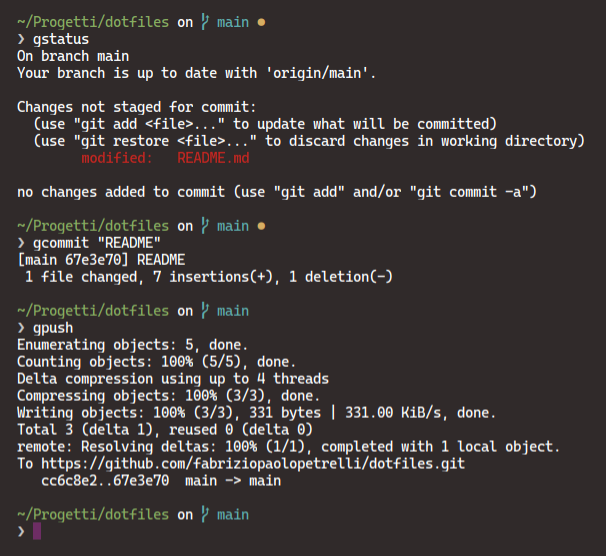

# dotfiles

Dotfiles for customizing ZShell and Gnome

I've included also a poor script for symlinking and setting up the repo  (Some command such as the update of the packages will only work on debian like distros)

# Installation

<ol>
<li>Create a folder wherever you like named 'Projects'</li>
<li>Clone the repository in that folder</li>
<ul><li><code>git clone https://github.com/fabriziopaolopetrelli/dotfiles.git dotfiles</code></li></ul>
<li>Open a terminal from the repository folder</li>
<li>Make the install script executable</li>
<ul><li><code>sudo chmod +x init.sh</code></li></ul>
<li>Run the script and enjoy!</li>
<ul><li><code>./init.sh</code></li></ul>
</ol>

# ZShell config

There are also some aliases for git, node and zsh
 

# Aliases

<table style="width: 600px;">
  <tr>
    <td><b>Alias</b></td>
    <td><b>Description</b></td>
  </tr>  
<tr>
  <td>update</td>
  <td>Will update the ubuntu repos and then upgrade them</td>
</tr>
<tr>
  <td>cls</td>
  <td>Will clear the console from the commands</td>
</tr>
<tr>
  <td>sinst</td>
  <td>Will install the specified package writed after the command  (Snap Package manager)</td>
</tr>
<tr>
  <td>gadd</td>
  <td>Will add ALL the files not tracked of the current repository to git</td>
</tr>
<tr>
  <td>gcommit</td>
  <td>Will commit ALL the files added to the tracked one in the git repository  (You also have to include a message inside quotes)</td>
</tr>
<tr>
  <td>gpush</td>
  <td>Will push the commit</td>
</tr>
<tr>
  <td>gpull</td>
  <td>Will pull the changes from a repo</td>
</tr>
<tr>
  <td>gbranch</td>
  <td>If there are no arguments it displays the current branch, otherwise it will create a new branch with the argument as name</td>
</tr>
<tr>
  <td>gswitch</td>
  <td>Will switch to the branch passed as argument</td>
</tr>
<tr>
  <td>gstatus</td>
  <td>Will show the status of the files in the current branch</td>
</tr>
<tr>
  <td>gmerge</td>
  <td>Will merge a branch into another  (merges the branch you pass as arguments in the branch you currently are)</td>
</tr>
<tr>
  <td>nstart</td>
  <td>npm start</td>
</tr>
<tr>
  <td>ninst</td>
  <td>Will install the package passed as argument from the node package manager</td>
</tr>
</table>
